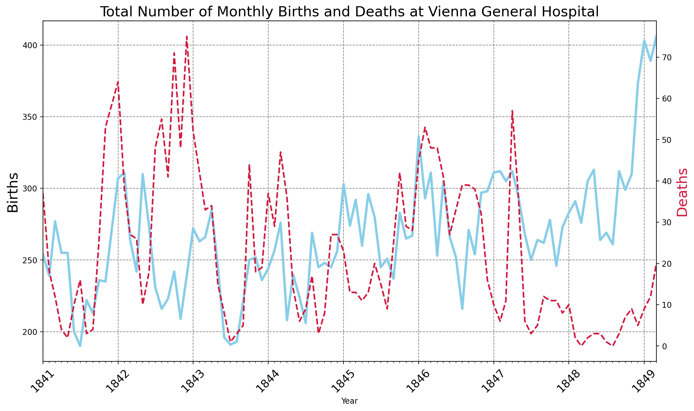
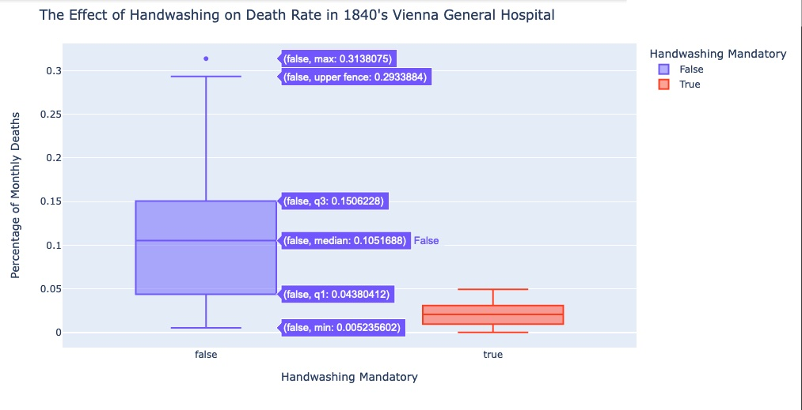

# The Tragic Discovery of Handwashing: t-Tests & Distributions. Analyses data from the 1840's and introduce t-tests and distributions to corroborate findings.
- 👋 Hi, I’m @WilliamSpanfelner
- 👀 I’m interested in using Python with Swift in iOS environments and why it may or may not be desirable.
- 🌱 I’m currently learning Python with the London App Brewery and Angela Yu's [100 Days of Code: 
The Complete Python Pro Bootcamp for 2022](https://www.udemy.com/course/100-days-of-code/) on Udemy.  
- 🧑‍💻  Records indicate that childbirth was really quite dangerous and could easily result in a mother's death in 1840's Austria.  This project follows in the foot steps of a doctor attempting to find the causes of the deaths.  Thankfully, Louis Pastuer also followed in his foot steps allowing us to take advantage of significantly reduced risks for routine medical treatments.  New statistical tools to learn. Enjoy. 
- 💞️ I’m looking to collaborate on application development.
- 📫 How to reach me...

[//]: # ([![email](https://img.shields.io/badge/email-wil--1--am%40outlook.com-grey?style=plastic)](mailto:wil-1-am@outlook.com))

